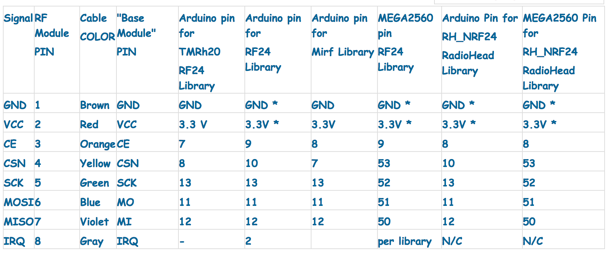
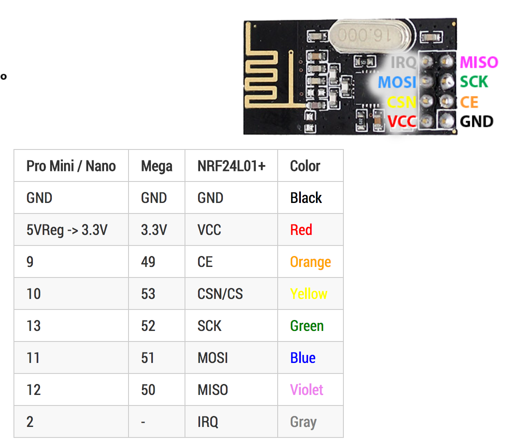
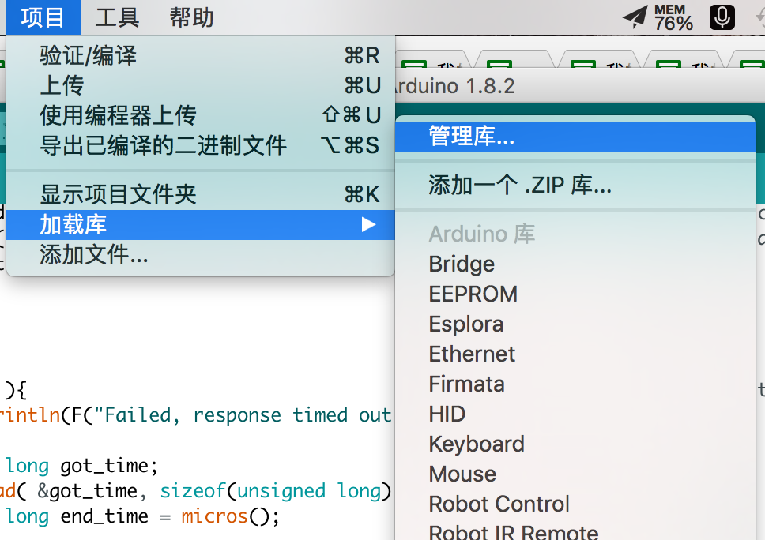
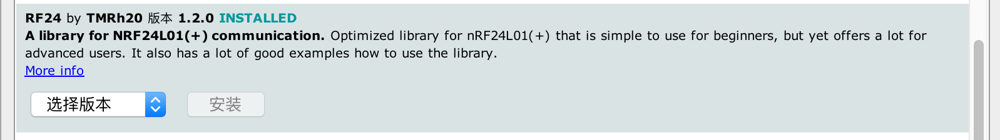
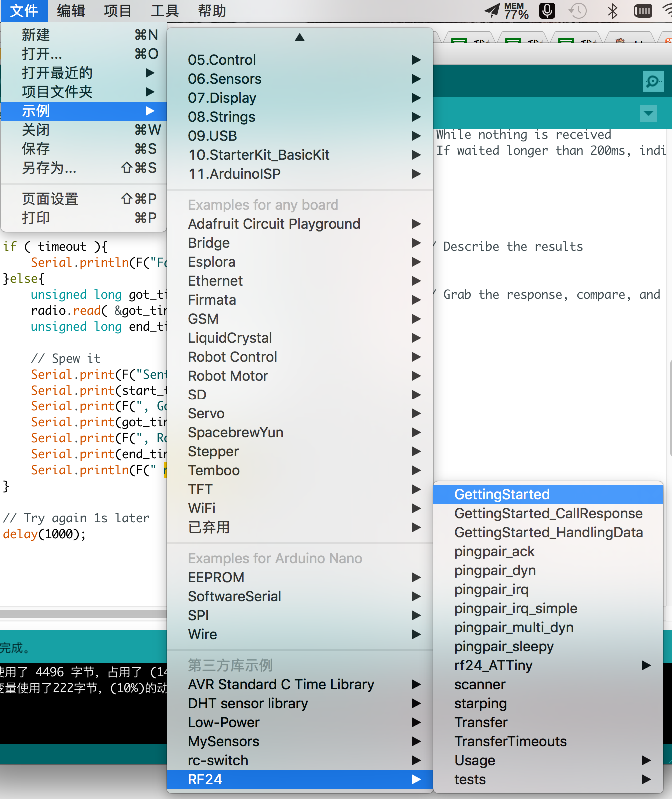
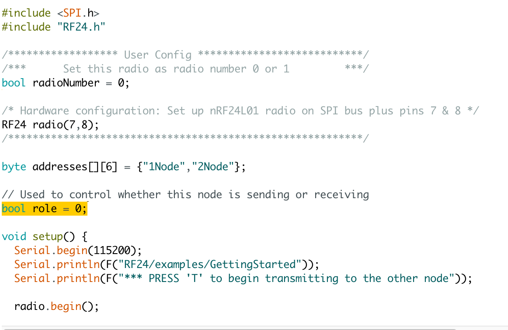
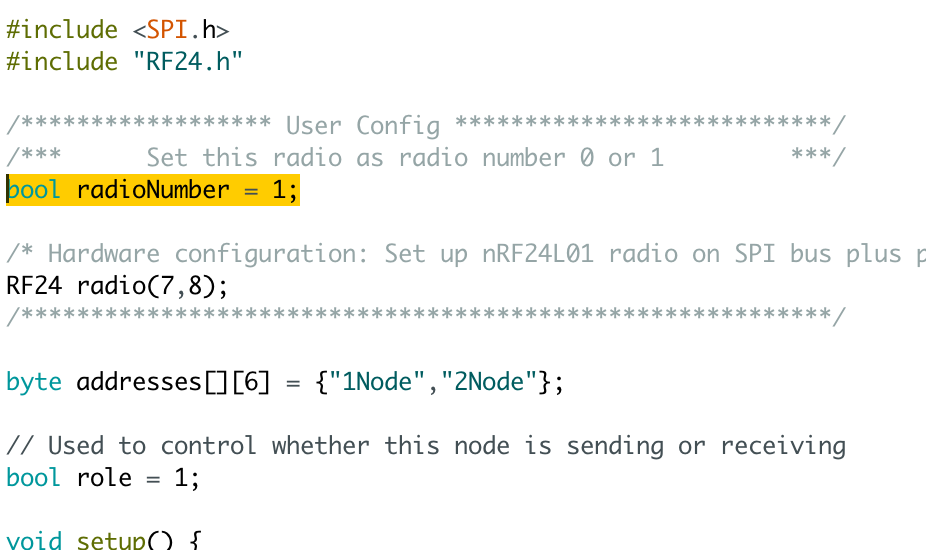
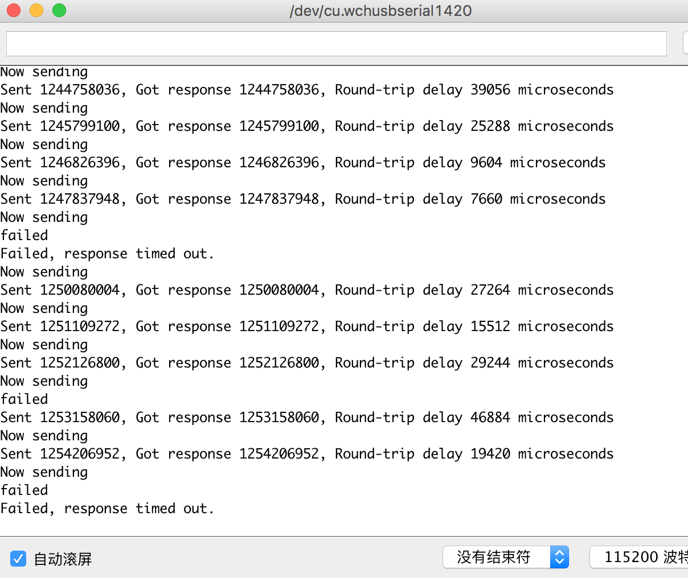

版权归作者所有，任何形式转载请联系作者。
作者：渴望力量の柠叔（来自豆瓣）
来源：https://www.douban.com/note/620072271/

购买链接：
==========

NRT24L01+

https://item.taobao.com/item.htm?spm=a1z09.2.0.0.8us8c0&id=522572193384&_u=c1ka3ne7a201

Ardunio Nano

https://detail.tmall.com/item.htm?id=44127880320&spm=a1z09.2.0.0.8us8c0&_u=c1ka3ne7a6a6

链接硬件
==========

https://arduino-info.wikispaces.com/Nrf24L01-2.4GHz-HowTo

参考的是上面这篇文章


图1


图2
建议将杜邦线按照：Red/Orange/Yellow/Green/Blue/Violet/Gray的方式，参照与NRT24L01+先链接上；

然后根据所使用的库，再参照图1，来进行实际的链接；

我最终的链接是：

```
NRT24L01+                Nano

Black--------------------->GND

Red---------------------->VCC

Orange----------------->D7

Yellow------------------>D8

Green------------------>D13

Blue--------------------->D11

Violet------------------->D12

Gray--------------------->NC(不接)
```

加载库
=====




使用RF24来搜索，我们使用TMRh20的RF24库


打开实例文件
==========



打开RF24-->GettingStarted

修改示例：


角色为0，就是接收方；

1是发射方

修改完后保存为recive工程

然后再打开一个工程


修改如上，将role变为1，意为发射，然后radioNumber=1；

说实话，我也不太懂这个参数，反正先改了再说；


结果
====

打开串口调试器



可以看到，发送的是时间，接收方会将这个值直接pong回来；

另外19420是微妙

打印的里面的意思就是来回用了19ms，46ms，29ms

当然也会超时，如果超出200ms，就结束一个来回；


距离
===

将PONG端，放在室内

然后将PING端，接上MAC

带到室外去

大概测了一下，这种PCB天线的距离很近很近，大概能穿一个水泥墙

然后10M左右的距离；

也是醉了....

还没测功耗....并不是特别理想的距离；

不过作为那啥来说，其实是够了的；